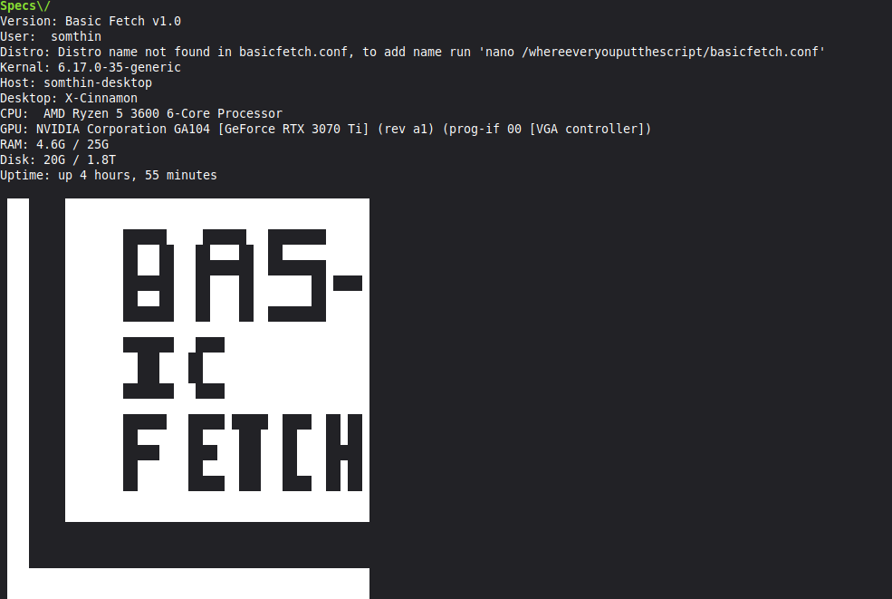
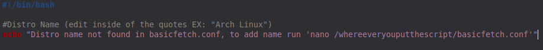

# BasicFetch
BasicFetch is a simple, open-source and customizable neofetch-like Linux utility written in Bash.

 

<h2> Installation guide</h2>

Once you have extracted the .zip file and put the 2 files (basicfetch and basicfetch.conf) in your home folder (or whereever you like), 
run these 2 commands.

1: "chmod +x basicfetch" (makes the file run as an executable script)

2: "chmod +x basicfetch.conf" (makes the configuration file executable (its how its read))

once you have finished those commands open the config file, delete the 'not found' message and enter your linux disro's name

<h2>Lastly, run it!</h2>
type in "./basicfetch" into your terminal and enjoy!
